# FWP-in-Class Technical Diagrams

## System Architecture Overview

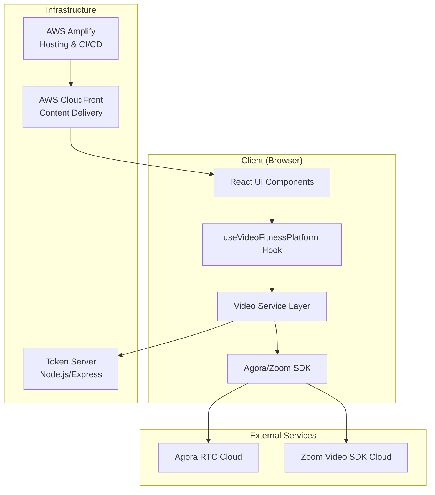

## Video Service Architecture

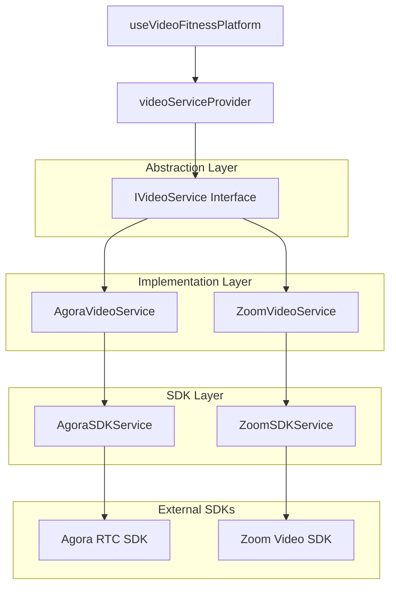

## Event-Driven State Management

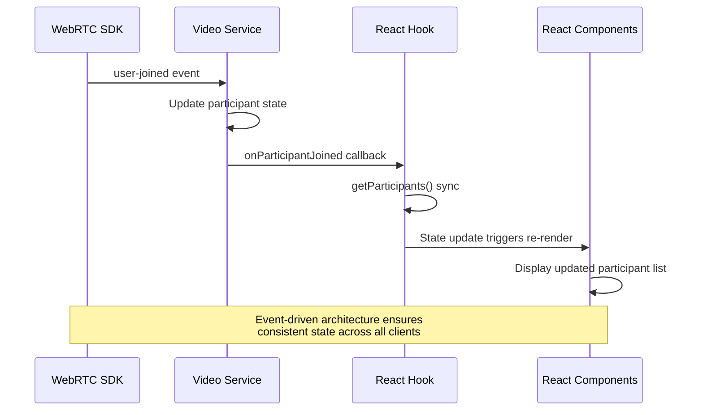

## Session Flow Architecture

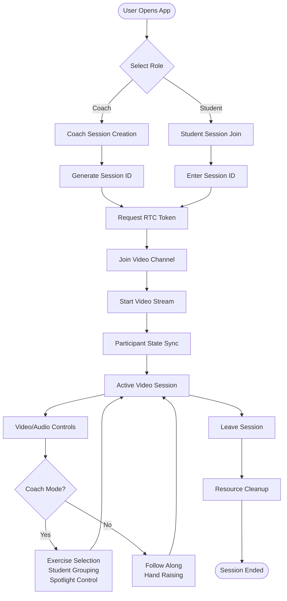

## Component Hierarchy

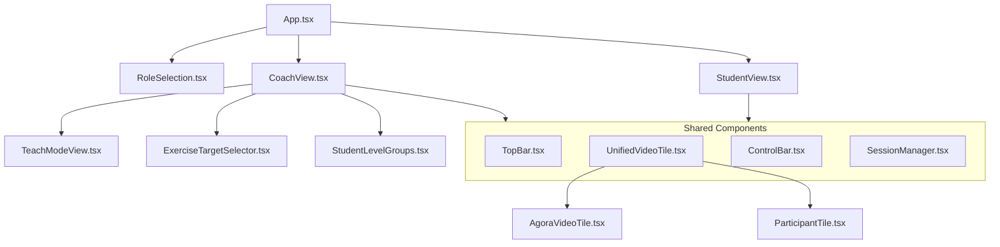

## Data Flow Architecture

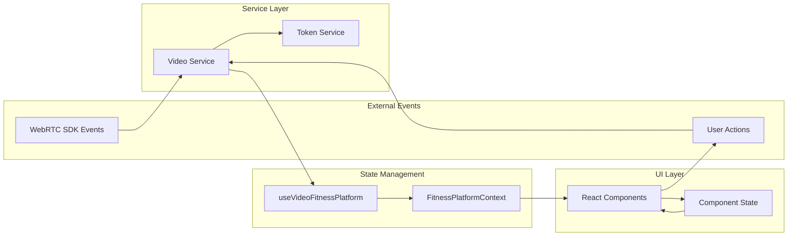

## Network Architecture

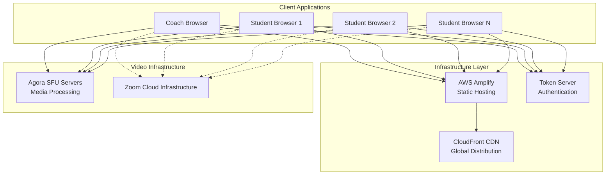

## WebRTC Connection Flow

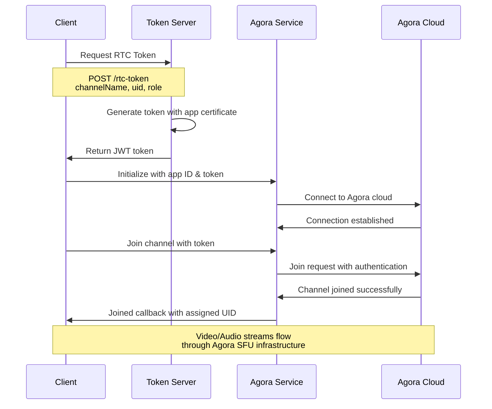

## Error Handling Flow

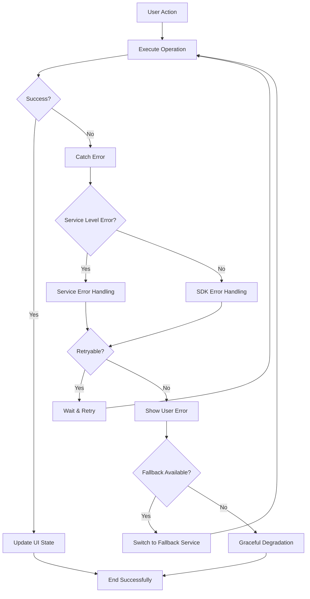

## Performance Optimization Flow

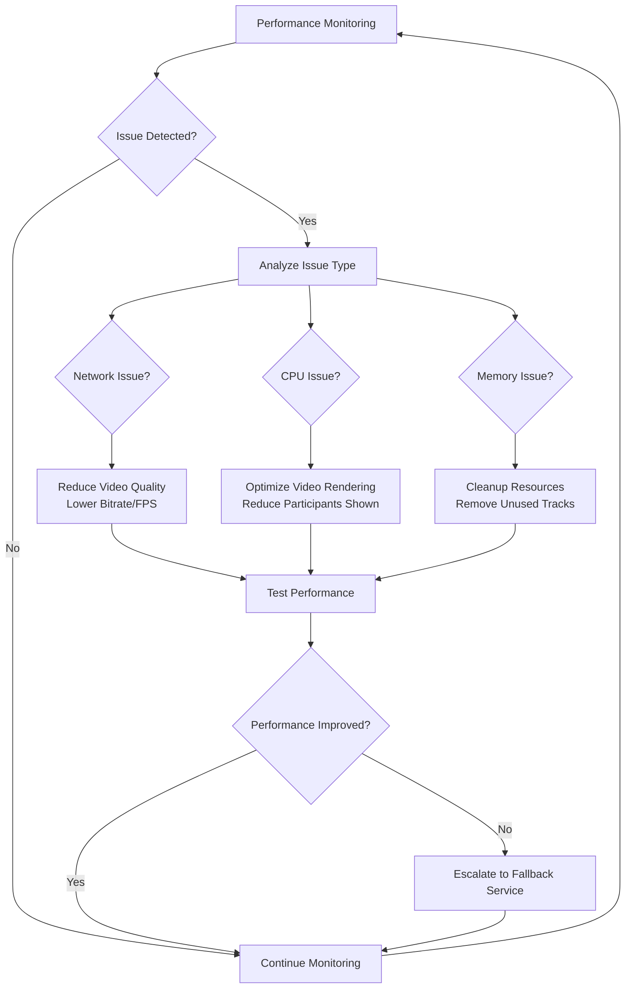

## Development vs Production Flow

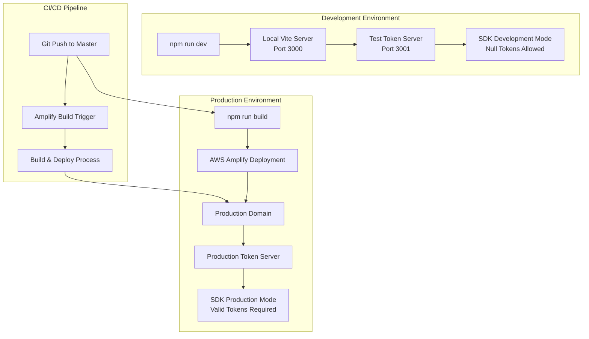

---

*These technical diagrams provide visual representation of the FWP-in-Class architecture. For detailed implementation, refer to ARCHITECTURE.md and the source code.*