# FitWithPari: In-Class Experience Flow Chart

## Overview
This document outlines the complete flow of a live fitness class experience on the FitWithPari platform. These Mermaid diagrams show every user interaction, system response, and feature integration throughout the class session.

---

## 🎓 Coach In-Class Experience Flow: Primary Control Flow

```mermaid
graph TD
    A["🚀 Class Session Starts<br/>Coach enters live video session<br/>All systems initialize"] --> B["📹 Video/Audio Check<br/>Verify camera and microphone working<br/>Test connection quality<br/>Ensure optimal streaming setup"]
    B --> C["👥 Student Admission Process<br/>Review waiting room participants<br/>Check student readiness<br/>Admit students individually or in groups"]
    C --> D["⚙️ Initial Mode Selection<br/>Choose starting mode based on class plan<br/>Teach Mode: For demonstrations and instruction<br/>Workout Mode: For active exercise monitoring"]
    D --> E{"🎯 Mode Decision Point<br/>Determine class flow based on:<br/>• Exercise complexity<br/>• Student experience level<br/>• Class objectives"}
    E -->|"Demonstrate new exercise"| F["🎓 TEACH MODE ACTIVATED<br/>Coach video enlarged to 75% of screen<br/>Students see detailed demonstration<br/>Focus on form and technique"]
    E -->|"Monitor student performance"| G["💪 WORKOUT MODE ACTIVATED<br/>Equal grid layout for all participants<br/>Coach monitors individual progress<br/>Real-time performance tracking"]

    %% Teach Mode Branch
    F --> F1["🎓 Teach Mode Interface<br/>• Coach video dominates screen (spotlight)<br/>• Student thumbnails in sidebar<br/>• Exercise demo controls visible<br/>• Form instruction overlay"]
    F1 --> F2["🎯 Exercise Selection<br/>Choose from exercise library<br/>Select appropriate difficulty level<br/>Prepare demonstration materials"]
    F2 --> F3["👁️ Live Demonstration<br/>Perform exercise with proper form<br/>Explain key technique points<br/>Address common mistakes"]
    F3 --> F4["❓ Q&A Interaction<br/>Monitor raised hands indicator<br/>Address student questions<br/>Provide clarifications"]
    F4 --> F5["🎯 Exercise Assignment<br/>Assign specific exercises to groups<br/>Set rep targets per fitness level<br/>Customize for health considerations"]
    F5 --> H["🔄 Mode Switch Decision<br/>Ready to monitor performance?<br/>Students understand exercise?<br/>Time to start active workout?"]

    %% Workout Mode Branch
    G --> G1["🏃 Workout Mode Interface<br/>• Grid view of all participants<br/>• Real-time rep counters visible<br/>• Connection quality indicators<br/>• Form alert monitoring system"]
    G1 --> G2["👀 Multi-Student Monitoring<br/>Track 10+ students simultaneously<br/>Monitor rep count progress<br/>Watch for form issues<br/>Check engagement levels"]
    G2 --> G3["📊 Real-Time Analytics<br/>View progress dashboard:<br/>• Individual rep counts vs targets<br/>• Completion percentages<br/>• Effort indicators<br/>• Health status alerts"]
    G3 --> G4["🚨 Alert Management<br/>Receive and respond to:<br/>• Form correction alerts<br/>• Health consideration warnings<br/>• Connection quality issues<br/>• Student help requests"]
    G4 --> G5["🎯 Dynamic Adjustments<br/>Modify rep targets in real-time<br/>Reassign exercises based on performance<br/>Provide individual coaching<br/>Adjust difficulty levels"]
    G5 --> I["🔄 Mode Switch Decision<br/>Need to teach new exercise?<br/>Students struggling with form?<br/>Time for demonstration?"]

    %% Mode Switching
    H -->|"Start workout phase"| G1
    I -->|"Need to demonstrate"| F1
    H -->|"Continue teaching"| F3
    I -->|"Continue monitoring"| G2

    %% Parallel Coach Actions
    J["⚡ Continuous Coach Actions<br/>Available in both modes"] --> J1["🔊 Audio Management<br/>Mute/unmute students<br/>Adjust volume levels<br/>Manage background noise"]
    J --> J2["👤 Participant Control<br/>Spotlight individual students<br/>Remove disruptive participants<br/>Promote student engagement"]
    J --> J3["💬 Communication Tools<br/>Send motivational messages<br/>Provide form corrections<br/>Share encouragement"]
    J --> J4["⏱️ Session Management<br/>Track class time remaining<br/>Manage exercise transitions<br/>Control session recording"]
```

## 👥 Coach Group Management System

```mermaid
graph TD
    A["👥 Student Grouping Overview<br/>Automatic fitness level detection<br/>Manual coach assignment capability<br/>Health consideration integration"] --> B["🔍 Level Assessment<br/>Review student fitness profiles<br/>Analyze previous performance data<br/>Consider health restrictions"]
    B --> C["🎯 Group Assignment Decision<br/>Assign students to appropriate groups<br/>Balance group sizes<br/>Consider individual needs"]
    C --> D["🟢 Beginner Group<br/>Students new to fitness<br/>Focus on form and safety<br/>Modified exercise variations<br/>Lower intensity targets"]
    C --> E["🟡 Intermediate Group<br/>Students with basic fitness<br/>Standard exercise variations<br/>Moderate intensity levels<br/>Progressive challenges"]
    C --> F["🔵 Advanced Group<br/>Experienced fitness enthusiasts<br/>Complex exercise variations<br/>High intensity targets<br/>Performance optimization"]
    C --> G["⚕️ Special Considerations<br/>Students with health conditions<br/>Injury accommodations<br/>Pregnancy modifications<br/>Age-specific adaptations"]

    H["📋 Exercise Assignment Process<br/>Coach selects exercise from library<br/>System suggests appropriate variations<br/>Customization for each group"] --> I{"🎯 Target Audience Selection<br/>Who should receive this exercise?"}
    I -->|"All Students"| J["📢 Universal Assignment<br/>Same exercise, different variations<br/>Automatic level-appropriate adjustments<br/>Individual rep target scaling"]
    I -->|"Specific Level"| K["🎯 Level-Targeted Assignment<br/>Exercise sent only to selected group<br/>Other groups continue current activity<br/>Focused skill development"]
    I -->|"Individual Student"| L["👤 Personal Assignment<br/>Exercise customized for one person<br/>Address specific needs or goals<br/>Accommodate unique circumstances"]

    M["✨ Group Highlighting System<br/>Visual emphasis for targeted groups<br/>Enhanced coach oversight<br/>Student group awareness"] --> N["🖱️ Coach Clicks Group Badge<br/>Initiate highlighting for specific level<br/>Visual feedback in interface<br/>Group identification enhancement"]
    N --> O["🌟 Visual Highlighting Active<br/>Targeted group videos get colored borders<br/>Group members see they're selected<br/>Coach easily identifies target students"]
    O --> P["📊 Group Performance Tracking<br/>Monitor highlighted group collectively<br/>Compare group performance metrics<br/>Adjust group-specific targets"]
    P --> Q["💡 Group-Based Feedback<br/>Provide collective encouragement<br/>Address common group challenges<br/>Celebrate group achievements"]

    R["🔄 Exercise Variation System<br/>Single exercise, multiple difficulty levels<br/>Automatic adaptation based on student level<br/>Seamless delivery to appropriate groups"] --> S["📝 Exercise Definition<br/>Base exercise with full description<br/>Key form points and safety notes<br/>Benefits and target muscle groups"]
    S --> T["🟢 Beginner Variation<br/>Simplified movement patterns<br/>Reduced range of motion<br/>Assisted or modified positions<br/>Focus on learning proper form"]
    S --> U["🟡 Intermediate Variation<br/>Standard exercise execution<br/>Full range of motion<br/>Bodyweight or light resistance<br/>Emphasis on technique refinement"]
    S --> V["🔵 Advanced Variation<br/>Complex movement patterns<br/>Added resistance or instability<br/>Explosive or plyometric elements<br/>Performance and strength focus"]
    S --> W["⚕️ Modified Variation<br/>Health condition accommodations<br/>Injury-safe alternatives<br/>Low-impact modifications<br/>Therapeutic adaptations"]
```

## 👤 Student In-Class Experience Flow

## 🎯 Student Fitness Level Experience

```mermaid
graph TD
    A["🎯 Fitness Level System<br/>Determines exercise variations<br/>Sets appropriate rep targets<br/>Customizes safety guidelines<br/>Groups students for targeted instruction"] --> B{"🔍 Level Determination<br/>How is student's level assigned?"}
    B -->|"Initial Assessment"| C["📋 Fitness Assessment Quiz<br/>Questions about exercise experience<br/>Physical capability evaluation<br/>Previous fitness history<br/>Health and mobility check"]
    B -->|"Coach Assignment"| D["👨‍🏫 Coach Manual Override<br/>Coach observes student performance<br/>Adjusts level based on capability<br/>Considers health limitations<br/>Personalizes for individual needs"]
    B -->|"Performance Based"| E["📊 Data-Driven Assignment<br/>Analysis of previous class performance<br/>Rep completion rates<br/>Form quality assessments<br/>Progression tracking"]

    C --> F["🟢 BEGINNER LEVEL EXPERIENCE<br/>New to fitness or returning after break<br/>Focus on safety and proper form<br/>Modified, low-impact exercises<br/>Supportive learning environment"]
    D --> G["🟡 INTERMEDIATE LEVEL EXPERIENCE<br/>Regular exercise experience<br/>Standard movement patterns<br/>Moderate intensity challenges<br/>Skill development focus"]
    E --> H["🔵 ADVANCED LEVEL EXPERIENCE<br/>High fitness level and experience<br/>Complex exercise variations<br/>Maximum intensity challenges<br/>Performance optimization"]

    %% Beginner Experience Details
    F --> F1["🎯 Beginner Exercise Variations<br/>• Push-ups: Knee or wall modifications<br/>• Squats: Chair-assisted or partial range<br/>• Planks: Inclined or shortened duration<br/>• Cardio: Low-impact alternatives"]
    F1 --> F2["📊 Beginner Rep Targets<br/>Lower repetition goals (5-10 reps)<br/>Focus on quality over quantity<br/>Frequent rest periods encouraged<br/>Achievement celebrates form completion"]
    F2 --> F3["🧠 Beginner Education<br/>Detailed form explanations<br/>Safety warning emphasis<br/>Movement breakdown instruction<br/>Encouragement for effort over results"]
    F3 --> F4["💚 Beginner Support System<br/>Extra coach attention<br/>Peer encouragement<br/>Progress celebration<br/>Confidence building focus"]

    %% Intermediate Experience Details
    G --> G1["🎯 Intermediate Exercise Variations<br/>• Push-ups: Standard form<br/>• Squats: Full range bodyweight<br/>• Planks: Standard duration<br/>• Cardio: Moderate intensity"]
    G1 --> G2["📊 Intermediate Rep Targets<br/>Moderate repetition goals (10-15 reps)<br/>Balance of volume and intensity<br/>Progressive overload introduction<br/>Consistency and improvement focus"]
    G2 --> G3["🧠 Intermediate Education<br/>Technique refinement<br/>Exercise progression options<br/>Performance optimization tips<br/>Injury prevention strategies"]
    G3 --> G4["🧡 Intermediate Challenge System<br/>Skill development opportunities<br/>Performance tracking<br/>Group competition elements<br/>Personal record encouragement"]

    %% Advanced Experience Details
    H --> H1["🎯 Advanced Exercise Variations<br/>• Push-ups: Single-arm or plyometric<br/>• Squats: Jump squats or single-leg<br/>• Planks: Dynamic or weighted<br/>• Cardio: High-intensity intervals"]
    H1 --> H2["📊 Advanced Rep Targets<br/>Higher repetition goals (15-25+ reps)<br/>Time-based challenges<br/>Complex movement patterns<br/>Performance and strength focus"]
    H2 --> H3["🧠 Advanced Education<br/>Biomechanics optimization<br/>Advanced technique variations<br/>Performance analytics<br/>Competitive training methods"]
    H3 --> H4["💙 Advanced Achievement System<br/>Performance benchmarks<br/>Leadership opportunities<br/>Technique demonstration<br/>Peer mentoring possibilities"]

    %% Level Progression System
    I["📈 Level Progression Tracking<br/>Monitor student improvement<br/>Identify readiness for advancement<br/>Provide upgrade opportunities"] --> J["📊 Performance Metrics<br/>Consistency in attendance<br/>Rep target completion rates<br/>Form quality improvements<br/>Engagement and participation"]
    J --> K{"🔄 Progression Decision<br/>Ready for next level?"}
    K -->|"Consistent Excellence"| L["⬆️ Level Advancement<br/>Coach promotes to next level<br/>Gradual transition period<br/>New challenges introduced<br/>Celebration of achievement"]
    K -->|"Need More Development"| M["📚 Continued Development<br/>Additional practice at current level<br/>Focused skill building<br/>Patience with progression<br/>Maintain motivation"]
    K -->|"Struggling with Current"| N["⬇️ Temporary Level Adjustment<br/>Move to more appropriate level<br/>Focus on building confidence<br/>Address specific challenges<br/>Supportive environment"]
```

## 🔄 Real-Time Synchronization Flow

```mermaid
graph TD
    A["🌐 Real-Time System Architecture<br/>Supabase database backend<br/>WebSocket connections for instant updates<br/>Conflict resolution by coach authority<br/>Optimistic UI updates"] --> B["⚡ State Change Triggers<br/>Any user action that affects shared state<br/>Coach mode switches, exercise assignments<br/>Rep count updates, participant changes"]
    B --> C["📤 Client-Side Action<br/>User performs action in interface<br/>Immediate UI update (optimistic)<br/>Action queued for server sync<br/>Loading states displayed if needed"]
    C --> D["🔄 Server Processing<br/>Supabase receives state change<br/>Validates action permissions<br/>Updates database records<br/>Broadcasts change to all clients"]
    D --> E["📥 Client Update Reception<br/>All connected clients receive update<br/>Compare with local optimistic state<br/>Resolve any conflicts<br/>Update UI with confirmed state"]
    E --> F["🎯 UI State Reconciliation<br/>Merge server state with local state<br/>Handle edge cases and conflicts<br/>Maintain smooth user experience<br/>Show error states if needed"]

    G["🎓 Mode Switch Synchronization<br/>Coach changes from Teach to Workout mode"] --> G1["👨‍🏫 Coach Action<br/>Coach clicks 'Switch to Workout Mode'<br/>UI immediately reflects change<br/>State update sent to server"]
    G1 --> G2["📡 Server Broadcast<br/>Supabase pushes mode change<br/>All student clients receive update<br/>Mode change event triggered"]
    G2 --> G3["👥 Student Interface Updates<br/>Layout automatically transitions<br/>Teach mode view → Workout mode view<br/>Rep counters become active<br/>Timer starts if applicable"]
    G3 --> G4["✅ Sync Confirmation<br/>All clients confirm mode change<br/>System in consistent state<br/>Full functionality available"]

    H["📊 Rep Counter Synchronization<br/>Student increments rep count"] --> H1["👤 Student Action<br/>Student taps + button on rep counter<br/>Local count immediately increases<br/>Visual feedback provided instantly"]
    H1 --> H2["📤 Database Update<br/>New rep count sent to Supabase<br/>Student's record updated<br/>Change broadcast to coach"]
    H2 --> H3["👨‍🏫 Coach Dashboard Update<br/>Coach sees updated rep count<br/>Progress bar reflects change<br/>Achievement notifications if target met"]
    H3 --> H4["🎯 Target Check<br/>System checks if rep target reached<br/>Triggers celebration if achieved<br/>Updates group progress statistics"]

    I["🎯 Exercise Assignment Synchronization<br/>Coach assigns exercise to specific group"] --> I1["👨‍🏫 Coach Assignment<br/>Coach selects exercise and target group<br/>Assignment parameters set<br/>Immediate coach UI confirmation"]
    I1 --> I2["🎛️ Server Processing<br/>Exercise assignment saved<br/>Target group members identified<br/>Customized variations prepared"]
    I2 --> I3["📨 Targeted Delivery<br/>Exercise sent only to selected group<br/>Other students unaffected<br/>Level-appropriate instructions included"]
    I3 --> I4["👥 Student Reception<br/>Target group receives new exercise<br/>Exercise panel updates automatically<br/>Rep targets set based on level<br/>Instructions displayed clearly"]

    J["📶 Connection Quality System<br/>Continuous monitoring of all participants<br/>Adaptive video quality adjustment<br/>Graceful degradation handling"] --> J1["📊 Quality Monitoring<br/>Real-time bandwidth measurement<br/>Video frame rate analysis<br/>Audio quality assessment<br/>Latency tracking"]
    J1 --> J2{"⚠️ Quality Issues Detected<br/>Connection problems identified"}
    J2 -->|"Minor Issues"| J3["🔧 Automatic Adjustments<br/>Reduce video resolution<br/>Lower frame rate<br/>Compress audio stream<br/>Maintain functionality"]
    J2 -->|"Major Issues"| J4["🚨 Intervention Required<br/>Notify user of problems<br/>Suggest troubleshooting steps<br/>Offer audio-only mode<br/>Prevent session disruption"]
    J3 --> J5["✅ Quality Restored<br/>Monitor for improvement<br/>Gradually increase quality<br/>Return to optimal settings<br/>Seamless user experience"]
    J4 --> J6["🔄 Recovery Process<br/>Guide user through fixes<br/>Test connection improvements<br/>Rejoin session when stable<br/>Resume full participation"]

    K["⚔️ Conflict Resolution System<br/>Handle simultaneous actions<br/>Coach authority takes precedence<br/>Maintain data consistency"] --> K1["🔄 Simultaneous Actions<br/>Multiple users act at same time<br/>Potential state conflicts<br/>Race condition scenarios"]
    K1 --> K2["👨‍🏫 Coach Priority<br/>Coach actions always win conflicts<br/>Student actions deferred<br/>Authority-based resolution"]
    K2 --> K3["📢 Conflict Notification<br/>Inform users of resolution<br/>Explain final state<br/>Provide clear feedback<br/>Maintain trust in system"]
    K3 --> K4["🔄 State Restoration<br/>All clients sync to resolved state<br/>UI updates reflect final decision<br/>Session continues smoothly<br/>Learning from conflicts"]
```

## 🎯 Feature Integration Flow

```mermaid
graph TD
    A["🎛️ FitWithPari Feature Ecosystem<br/>Integrated system where all features<br/>work together seamlessly<br/>Each feature enhances others<br/>Holistic user experience"] --> B["👥 Student Level System<br/>Foundation for all personalization<br/>Drives exercise variations<br/>Influences rep targets<br/>Guides safety protocols"]
    B --> C["🎯 Exercise Assignment Engine<br/>Uses student levels for targeting<br/>Considers health limitations<br/>Adapts to class mode<br/>Provides appropriate variations"]
    C --> D["📊 Rep Counter Integration<br/>Targets set based on student level<br/>Progress tracked per individual<br/>Achievements trigger celebrations<br/>Data feeds into analytics"]
    D --> E["🚨 Form Alert System<br/>Monitors exercise execution<br/>Provides safety warnings<br/>Suggests corrections<br/>Connects to health considerations"]
    E --> F["📹 Video Mode Management<br/>Teach Mode: Focus on demonstration<br/>Workout Mode: Monitor performance<br/>Seamless transitions between modes<br/>Optimized layouts for each purpose"]

    G["🔗 Feature Interconnection Matrix<br/>How each feature enhances others"] --> G1["🎓 Teach Mode + Exercise Assignment<br/>Coach demonstrates exercise<br/>Assignment targets specific levels<br/>Instructions customized per group<br/>Visual focus on proper form"]
    G --> G2["💪 Workout Mode + Rep Counter<br/>Active exercise monitoring<br/>Real-time progress tracking<br/>Target achievement celebration<br/>Performance analytics collection"]
    G --> G3["👥 Student Levels + Health Considerations<br/>Level assignment considers health status<br/>Exercise modifications for safety<br/>Personalized difficulty adjustments<br/>Preventive care integration"]
    G --> G4["🚨 Form Alerts + Video Quality<br/>Higher video quality for form analysis<br/>Alert severity affects display priority<br/>Coach intervention through video<br/>Safety through visual monitoring"]
    G --> G5["📊 Rep Counter + Group Highlighting<br/>Group performance comparison<br/>Collective target achievement<br/>Group motivation and competition<br/>Team-building through fitness"]

    H["🎯 Complex Feature Scenarios<br/>Multiple features working together<br/>Advanced use cases<br/>Sophisticated interactions"] --> H1["📚 Scenario: New Exercise Introduction<br/>1. Coach switches to Teach Mode<br/>2. Demonstrates exercise to all students<br/>3. Assigns variations by fitness level<br/>4. Students receive level-appropriate instructions<br/>5. Rep targets set automatically<br/>6. Switch to Workout Mode for monitoring<br/>7. Form alerts monitor execution<br/>8. Progress tracked individually<br/>9. Group performance compared<br/>10. Achievements celebrated"]
    H --> H2["⚕️ Scenario: Health Consideration Management<br/>1. Student with knee injury joins class<br/>2. System flags health limitation<br/>3. Exercise assignments automatically modified<br/>4. Alternative variations provided<br/>5. Form alerts more sensitive for safety<br/>6. Rep targets adjusted for condition<br/>7. Coach receives injury notifications<br/>8. Special monitoring throughout session<br/>9. Recovery progress tracked<br/>10. Gradual return to normal activities"]
    H --> H3["🏆 Scenario: Group Challenge Activity<br/>1. Coach highlights intermediate group<br/>2. Assigns challenging exercise variation<br/>3. Sets competitive rep targets<br/>4. Group members see they're selected<br/>5. Rep counters track group progress<br/>6. Real-time leaderboard updates<br/>7. Motivational messages sent<br/>8. Achievement badges awarded<br/>9. Group celebration triggered<br/>10. Success shared with other groups"]

    I["📊 Integrated Data Flow<br/>Information flows between all features<br/>Creates comprehensive user profiles<br/>Enables intelligent adaptations"] --> I1["📈 Performance Analytics<br/>Rep count data from counters<br/>Exercise completion rates<br/>Form improvement tracking<br/>Attendance and engagement metrics"]
    I1 --> I2["🎯 Predictive Targeting<br/>AI suggests optimal exercises<br/>Predicts appropriate difficulty<br/>Recommends group assignments<br/>Identifies progression opportunities"]
    I2 --> I3["🏥 Health Integration<br/>Medical considerations in assignments<br/>Injury prevention suggestions<br/>Recovery progress monitoring<br/>Wellness trend analysis"]
    I3 --> I4["🎓 Learning Optimization<br/>Form improvement recommendations<br/>Skill development tracking<br/>Knowledge gap identification<br/>Personalized learning paths"]

    J["✨ Enhanced User Experience<br/>Features combine for superior experience<br/>Seamless interactions<br/>Intuitive interface"] --> J1["👨‍🏫 Coach Experience Enhancement<br/>Unified control panel<br/>Contextual information display<br/>Predictive assistance<br/>Streamlined workflow"]
    J1 --> J2["👤 Student Experience Enhancement<br/>Personalized interface<br/>Relevant information priority<br/>Motivational feedback loops<br/>Adaptive difficulty progression"]
    J2 --> J3["🔄 Continuous Improvement<br/>System learns from interactions<br/>Adapts to user preferences<br/>Optimizes feature combinations<br/>Evolves with usage patterns"]
```

---

## 📋 Implementation Notes

### Key Technical Requirements

1. **Real-Time Synchronization**: All flows require WebSocket connections with Supabase for instant updates
2. **State Management**: Complex state requires careful management of optimistic updates and conflict resolution
3. **Video Quality**: Adaptive streaming based on connection quality and participant count
4. **Error Handling**: Graceful degradation when features fail or connections are poor
5. **Performance**: Optimized for 100+ simultaneous participants

### Flow Integration Points

- **Mode Switches**: Critical synchronization points affecting all users
- **Exercise Assignments**: Multi-user targeting with personalization
- **Rep Counter Updates**: Real-time data flow to coach dashboard
- **Group Management**: Dynamic highlighting and performance tracking
- **Health Considerations**: Cross-feature safety system integration

### Future Enhancement Opportunities

- **AI Form Analysis**: Automated form correction alerts
- **Predictive Targeting**: ML-driven exercise recommendations
- **Advanced Analytics**: Deeper performance insights and trends
- **Social Features**: Enhanced peer interaction and motivation
- **Mobile Optimization**: Touch-optimized interface adaptations

This comprehensive flow documentation provides the complete picture of how FitWithPari operates from both coach and student perspectives, with full technical detail for implementation teams.